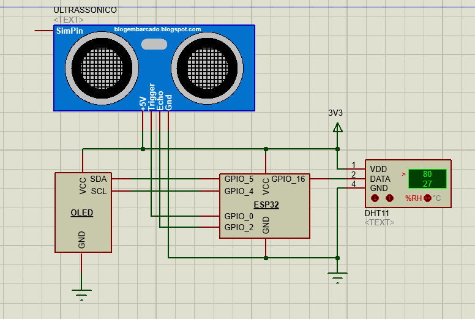
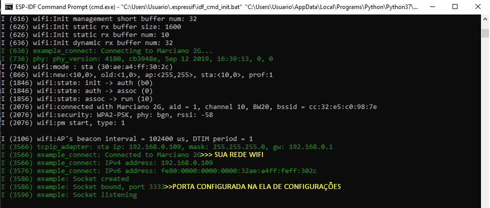

# :bookmark_tabs: Socket TCP Server: Disponibilizando informações de leituras de sensores
## :rocket: IoT Aplicada
#### - Orientador: [Vagner Rodrigues](https://github.com/vagner-rodrigues) 

### :dart: Objetivos do projeto
1. Aprender como configurar o ESP32 como um Socket TCP Server.
2. Aprimorar o uso de filas(Queue) e criação de tarefas(Tasks).
3. Recuperar informações disponibilizadas pelo servidor via app Socket Client TCP.
4. Mostrar as infomações dos sensores no display OLED.
5. Aprender a ler os sensores utilizados no projeto.

### :computer: Requisitos de software para rodar o projeto


 


### :electric_plug: Requisitos de hardware para rodar o projeto
- [Wemos ESP32 LoLin](https://diyprojects.io/media/2018/01/xwemos-lolin32-oled-ssd1306-face-to-face-aliexpress.jpg.pagespeed.ic.zh-bR05Y9m.jpg)
- [Sensor de Umidade e Temperatura - DHT11](https://www.vidadesilicio.com.br/media/catalog/product/cache/2/thumbnail/450x450/9df78eab33525d08d6e5fb8d27136e95/d/h/dht11_pins.png)
- [Display OLED 0.96" I2C](https://uploads.filipeflop.com/2015/06/FF_banner_face_intel_galileo_blog.png)
- [Jumpers](https://store-cdn.arduino.cc/usa/catalog/product/cache/1/image/520x330/604a3538c15e081937dbfbd20aa60aad/c/0/c000036_featured_1.jpg)

### :zap: Projeto eletrônico para fazer a ligação correta dos periféricos




## :link: Processo para iniciar o Socket TCP Server (PlatformIO) 
1. Abrir o projeto pelo PlatformIO. [:camera:](img-readme/platformIO.png)
2. Dentro do diretório executar  o comando ```pio run -t menuconfig``` pelo prompt do VS Code. [:camera:](img-readme/config-platformIO.png)
3. Após abrir a tela de configuração, seguir os passos ```3,4,5``` da próxima instrução.
4. Logo após sair da tela de configuração, ainda dentro do VS Code, clique no :heavy_check_mark: para buildar o projeto. [:camera:](img-readme/build-platformIO.png)
5. Após o build do projeto, você deverá clicar em :arrow_right: para gravar o programa na placa.[:camera:](img-readme/gravando-platformIO.png)
6. Após a gravação do programa, você deverá esperar uma imagem semelhante à imagem abaixo.

## :link: Processo para iniciar o Socket TCP Server (esp-idf) 
1. Abrir o framework esp-idf e seguir até a pasta raíz do projeto:  ```cd <Seu diretório>/tcp-server```.
2. Dentro do diretório executar  o comando ```idf.py menuconfig```. [:camera:](img-readme/idf-py-menu-config.png)
3. Após abrir a tela de configuração, entrar em ```Example configuration``` para fazer a configuração da porta que o servidor irá se conectar.[:camera:](img-readme/example-configuration.png)
4. Após fazer a configuração da porta, entrar em ```Example connection configuration ``` para fazer a configuração de conexão da rede Wifi; [:camera:](img-readme/example-connection-configuration.png)
5. Depois de ter configurado a rede wifi, saia da tela de configuração na opção ```Exit```.  [:camera:](img-readme/saia-da-tela.png)
6. Logo após sair da tela de configuração, ainda dentro do esp-idf, digite o comando ```idf.py flash monitor```. [:camera:](img-readme/flash-monitor.png)
7. Após o build do projeto, você deverá esperar imagem semelhante à imagem abaixo.



## :link: Processo para iniciar a aplicação client(RealTerm)
1. RealTerm. [:arrow_down:](https://sourceforge.net/projects/realterm/)
2. Para abrir a conexão com o Server Socket TCP, precisamos abrir o ```RealTerm``` e configurar o IP do nosso servidor e a porta que ele está conectado.  [:camera:](img-readme/real-term-inicio.png)
3. Clicando no botão ```Open```, você verá que o status ficará :white_check_mark:```Connected``` e no terminal do esp-idf terá a mensagem ```Socket accepted```.[:camera:](img-readme/real-term-conectado.png)
4. Para enviar algum comando pelo RealTerm, você deve ir na aba ```Send```, escrever o que você quer enviar e clicar em ``Send ASCII``.[:camera:](img-readme/real-term-envio-mensagem.png)


````
| Comandos aceitos pela aplicação |     Retorno esperado    |
|:-------------------------------:|:-----------------------:|
|               'u'               |    Umidade: <Value> %   |
|               't'               | Temperatura: <Value> °C |
|               'd'               |  Distancia: <Value> cm  |
|     'qualquer outro comando'    |     Comando inválido    |
````


### :mortar_board: Contribuidores do projeto 
 - [Artini Scarabelot](https://github.com/artinisc)
 - [José Paulo Zanardo Marciano](https://github.com/joseMarciano) 

